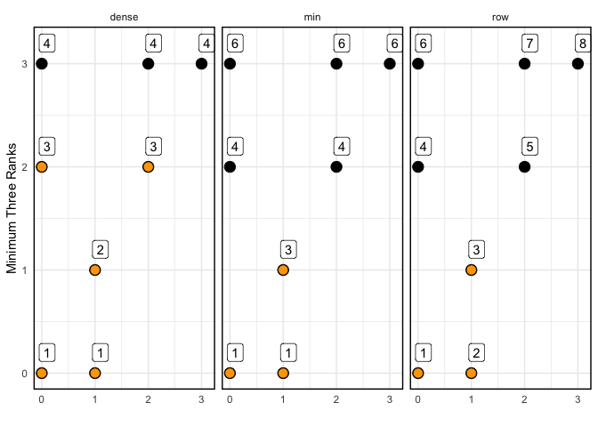

Visualize Rank Functions
================
Zachary del Rosario
2020-07-10

I find it difficult to remember how the various window rank functions
work. The following example graph is a useful reference to see a visual
difference between `row_number`, `min_rank`, and
    `dense_rank`.

``` r
library(tidyverse)
```

    ## ── Attaching packages ─────────────────────────────────────── tidyverse 1.3.0 ──

    ## ✔ ggplot2 3.3.1     ✔ purrr   0.3.4
    ## ✔ tibble  3.0.1     ✔ dplyr   1.0.0
    ## ✔ tidyr   1.1.0     ✔ stringr 1.4.0
    ## ✔ readr   1.3.1     ✔ forcats 0.5.0

    ## ── Conflicts ────────────────────────────────────────── tidyverse_conflicts() ──
    ## ✖ dplyr::filter() masks stats::filter()
    ## ✖ dplyr::lag()    masks stats::lag()

Here’s the visual:

``` r
tribble(
  ~x, ~y,
  0,  0,
  1,  0,
  1,  1,
  0,  2,
  2,  2,
  0,  3,
  2,  3,
  3,  3
) %>%
  mutate(
    rk_row = row_number(y),
    rk_min = min_rank(y),
    rk_dense = dense_rank(y)
  ) %>%
  pivot_longer(
    names_to = "fcn",
    names_prefix = "rk_",
    values_to = "rk",
    cols = c(-x, -y)
  ) %>%

  ggplot(aes(x, y)) +
  geom_point(size = 4) +
  geom_point(
    data = . %>% filter(rk <= 3),
    size = 3,
    color = "orange"
  ) +
  geom_label(aes(label = rk), nudge_x = 0.1, nudge_y = 0.2) +

  facet_wrap(~fcn) +
  theme_minimal() +
  theme(panel.border = element_rect(color = "black", fill = NA, size = 1)) +
  labs(
    x = "",
    y = "Minimum Three Ranks"
  )
```

<!-- -->
