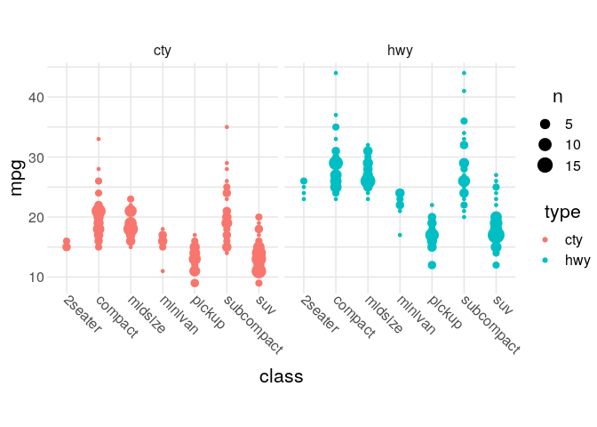

Common Theme
================
Zach
2019-12-10

**Purpose**: Quick theme for presentation- and publication-ready
figures.

``` r
library(tidyverse)
```

    ## ── Attaching packages ─────────────────────────────────────── tidyverse 1.3.0 ──

    ## ✔ ggplot2 3.2.1     ✔ purrr   0.3.3
    ## ✔ tibble  2.1.3     ✔ dplyr   0.8.3
    ## ✔ tidyr   1.0.0     ✔ stringr 1.4.0
    ## ✔ readr   1.3.1     ✔ forcats 0.4.0

    ## ── Conflicts ────────────────────────────────────────── tidyverse_conflicts() ──
    ## ✖ dplyr::filter() masks stats::filter()
    ## ✖ dplyr::lag()    masks stats::lag()

``` r
theme_common <- function() {
  theme_minimal() %+replace%
  theme(
    axis.text.x = element_text(size = 12),
    axis.text.y = element_text(size = 12),
    axis.title.x = element_text(margin = margin(4, 4, 4, 4), size = 16),
    axis.title.y = element_text(margin = margin(4, 4, 4, 4), size = 16, angle = 90),

    legend.title = element_text(size = 16),
    legend.text = element_text(size = 12),

    strip.text.x = element_text(size = 12),
    strip.text.y = element_text(size = 12),

    panel.grid.major = element_line(color = "grey90"),
    panel.grid.minor = element_line(color = "grey90"),

    aspect.ratio = 4 / 4,

    plot.margin   = unit(c(t = +0, b = +0, r = +0, l = +0), "cm"),
    plot.title    = element_text(size = 18),
    plot.subtitle = element_text(size = 16),
    plot.caption  = element_text(size = 14)
  )
}
```

Example; not a great plot, just demonstrating usage.

``` r
mpg %>%
  pivot_longer(
    cty:hwy,
    names_to = "type",
    values_to = "mpg",
  ) %>%

  ggplot(aes(class, mpg, color = type)) +
  geom_count(position = position_dodge(width = 0.5)) +
  ## Tail
  facet_grid(~type) +
  ## Use of theme
  theme_common() +
  theme(axis.text.x = element_text(angle = 315, hjust = 0))
```

<!-- -->

*Note*: Remember that you override `ggplot` options in layered fashion;
above I add more options to rotate the axis text.
