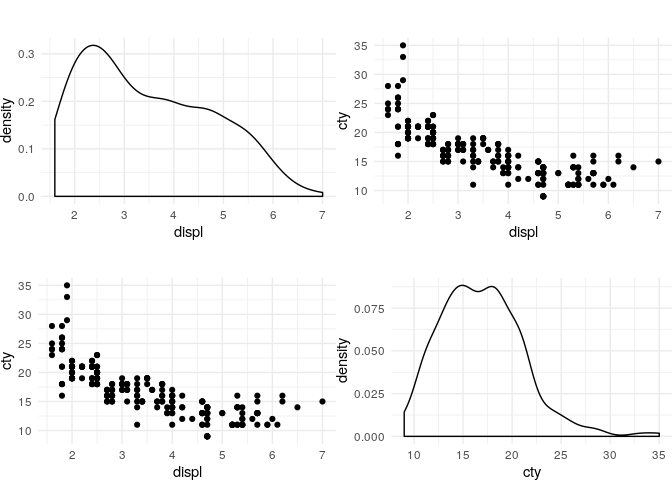
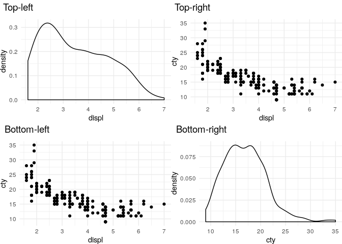
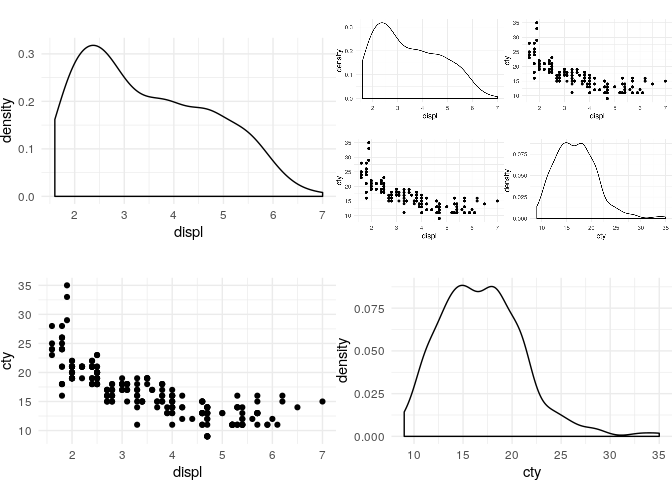

Cowplot (Tiled figures) Recipies
================
Zach
2019-12-30

Cowplot provides utilities for combining multiple ggplot
    figures.

``` r
library(tidyverse)
```

    ## ── Attaching packages ─────────────────────────────────────── tidyverse 1.3.0 ──

    ## ✔ ggplot2 3.2.1     ✔ purrr   0.3.3
    ## ✔ tibble  2.1.3     ✔ dplyr   0.8.3
    ## ✔ tidyr   1.0.0     ✔ stringr 1.4.0
    ## ✔ readr   1.3.1     ✔ forcats 0.4.0

    ## ── Conflicts ────────────────────────────────────────── tidyverse_conflicts() ──
    ## ✖ dplyr::filter() masks stats::filter()
    ## ✖ dplyr::lag()    masks stats::lag()

``` r
library(cowplot)
```

    ## 
    ## ********************************************************

    ## Note: As of version 1.0.0, cowplot does not change the

    ##   default ggplot2 theme anymore. To recover the previous

    ##   behavior, execute:
    ##   theme_set(theme_cowplot())

    ## ********************************************************

Use a common theme to control component plot margins.

``` r
theme_common <- function() {
  theme_minimal() %+replace%
  theme(plot.margin = unit(c(1.0, 0.0, 0.0, 0.0), "cm"))
}
```

Construct a manual scatterplot matrix (basic usage).

``` r
p_displ_v_cty <-
  mpg %>%
  ggplot(aes(displ, cty)) +
  geom_point() +
  theme_common()

p_displ <-
  mpg %>%
  ggplot(aes(displ)) +
  geom_density() +
  theme_common()

p_cty <-
  mpg %>%
  ggplot(aes(cty)) +
  geom_density() +
  theme_common()

## Cowplot
plot_grid(
  p_displ,
  p_displ_v_cty,
  p_displ_v_cty,
  p_cty,

  nrow = 2,
  ncol = 2
)
```

<!-- -->

``` r
ggsave("./tmp.png")
```

    ## Saving 7 x 5 in image

Add labels

``` r
## Cowplot
plot_grid(
  p_displ,
  p_displ_v_cty,
  p_displ_v_cty,
  p_cty,

  nrow = 2,
  ncol = 2,
  labels = c(
    "Top-left",
    "Top-right",
    "Bottom-left",
    "Bottom-right"
  ),

  hjust = -0.1,
  label_fontface = "plain"
)
```

<!-- -->

Load component images; note that the `magick` package is required
(`install.packages("magick")`).

``` r
p_loaded <-
  ggdraw() +
  draw_image("./tmp.png", scale = 1.0)

## Cowplot
plot_grid(
  p_displ,
  p_loaded,
  p_displ_v_cty,
  p_cty,

  nrow = 2,
  ncol = 2
)
```

<!-- -->
