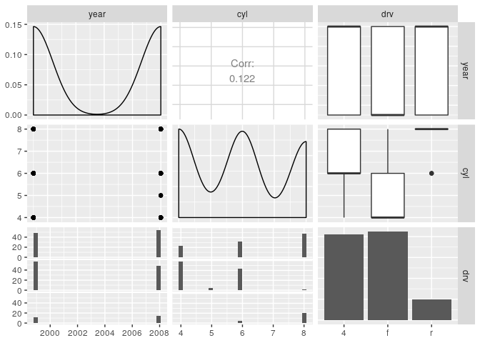
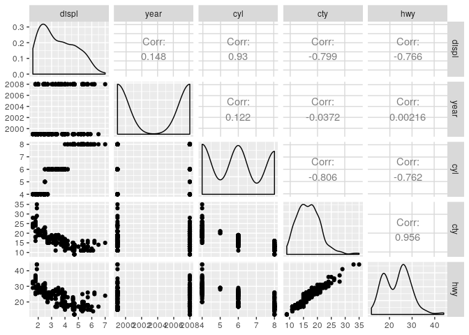
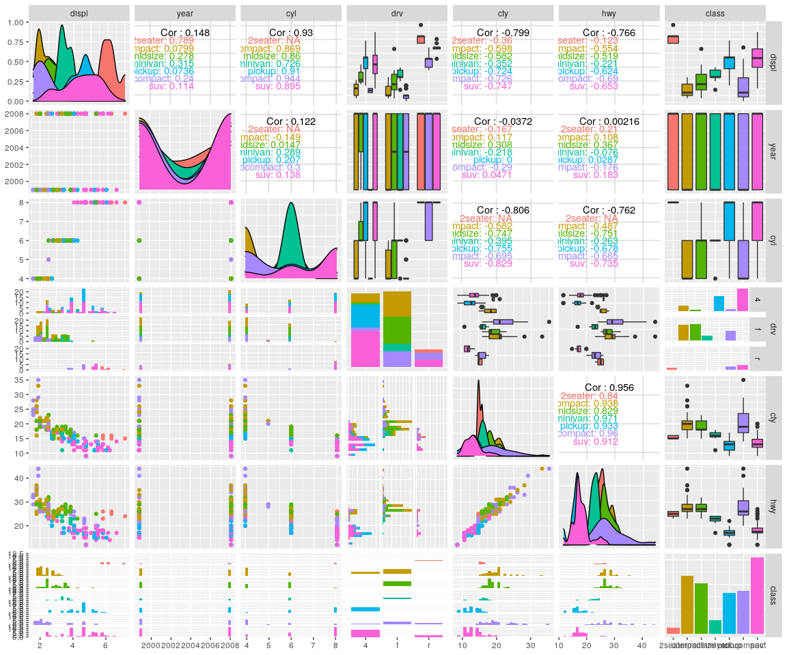

GGpairs
================
Zach
2019-12-30

GGpairs helps one create [scatterplot
matrices](https://en.wikipedia.org/wiki/Scatter_plot#Scatter_plot_matrices),
and is provided by the packages `GGally`.

``` r
library(tidyverse)
library(GGally)
```

Basic usage; plot a few variables.

``` r
mpg %>%
  select(year, cyl, drv) %>%
  ggpairs
```

    ## `stat_bin()` using `bins = 30`. Pick better value with `binwidth`.
    ## `stat_bin()` using `bins = 30`. Pick better value with `binwidth`.

<!-- -->

When plotting many variables, the printout can get annoying. Use
`print()` to suppress.

``` r
mpg %>%
  select_if(is.numeric) %>%
  ggpairs %>%
  print(progress = F)
```

    ## Warning in ggmatrix_gtable(x, ...): Please use the 'progress' parameter in
    ## your ggmatrix-like function call. See ?ggmatrix_progress for a few examples.
    ## ggmatrix_gtable 'progress' and 'progress_format' will soon be deprecated.TRUE

<!-- -->

`ggpairs` can take an `aes()` specification. Make sure you don’t select
out the column you’re trying to visualize\!

``` r
mpg %>%
  select(displ, year, cyl, drv, cty, hwy, class) %>%
  ggpairs(., mapping = aes(color = class)) %>%
  print(progress = F)
```

    ## Warning in ggmatrix_gtable(x, ...): Please use the 'progress' parameter in
    ## your ggmatrix-like function call. See ?ggmatrix_progress for a few examples.
    ## ggmatrix_gtable 'progress' and 'progress_format' will soon be deprecated.TRUE

    ## Warning in cor(x, y, method = method, use = use): the standard deviation is zero
    
    ## Warning in cor(x, y, method = method, use = use): the standard deviation is zero
    
    ## Warning in cor(x, y, method = method, use = use): the standard deviation is zero
    
    ## Warning in cor(x, y, method = method, use = use): the standard deviation is zero

    ## `stat_bin()` using `bins = 30`. Pick better value with `binwidth`.
    ## `stat_bin()` using `bins = 30`. Pick better value with `binwidth`.
    ## `stat_bin()` using `bins = 30`. Pick better value with `binwidth`.
    ## `stat_bin()` using `bins = 30`. Pick better value with `binwidth`.
    ## `stat_bin()` using `bins = 30`. Pick better value with `binwidth`.
    ## `stat_bin()` using `bins = 30`. Pick better value with `binwidth`.
    ## `stat_bin()` using `bins = 30`. Pick better value with `binwidth`.
    ## `stat_bin()` using `bins = 30`. Pick better value with `binwidth`.
    ## `stat_bin()` using `bins = 30`. Pick better value with `binwidth`.
    ## `stat_bin()` using `bins = 30`. Pick better value with `binwidth`.

<!-- -->
