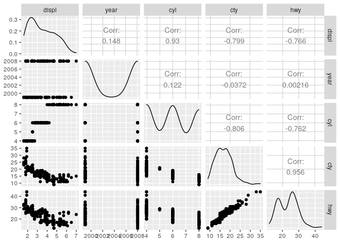

GGpairs
================
Zach
2019-12-30

GGpairs helps one create [scatterplot
matrices](https://en.wikipedia.org/wiki/Scatter_plot#Scatter_plot_matrices),
and is provided by the packages
    `GGally`.

``` r
library(tidyverse)
```

    ## ── Attaching packages ─────────────────────────────────────── tidyverse 1.3.0 ──

    ## ✔ ggplot2 3.3.0     ✔ purrr   0.3.3
    ## ✔ tibble  2.1.3     ✔ dplyr   0.8.5
    ## ✔ tidyr   1.0.2     ✔ stringr 1.4.0
    ## ✔ readr   1.3.1     ✔ forcats 0.5.0

    ## ── Conflicts ────────────────────────────────────────── tidyverse_conflicts() ──
    ## ✖ dplyr::filter() masks stats::filter()
    ## ✖ dplyr::lag()    masks stats::lag()

``` r
library(GGally)
```

    ## Registered S3 method overwritten by 'GGally':
    ##   method from   
    ##   +.gg   ggplot2

    ## 
    ## Attaching package: 'GGally'

    ## The following object is masked from 'package:dplyr':
    ## 
    ##     nasa

Basic usage; plot a few variables.

``` r
mpg %>%
  select(year, cyl, drv) %>%
  ggpairs
```

    ## `stat_bin()` using `bins = 30`. Pick better value with `binwidth`.
    ## `stat_bin()` using `bins = 30`. Pick better value with `binwidth`.

<!-- -->

When plotting many variables, the printout can get annoying. Use
`print()` to suppress.

``` r
mpg %>%
  select_if(is.numeric) %>%
  ggpairs %>%
  print(progress = F)
```

    ## Warning in ggmatrix_gtable(x, ...): Please use the 'progress' parameter in
    ## your ggmatrix-like function call. See ?ggmatrix_progress for a few examples.
    ## ggmatrix_gtable 'progress' and 'progress_format' will soon be deprecated.TRUE

<!-- -->

`ggpairs` can take an `aes()` specification. Make sure you don’t select
out the column you’re trying to visualize\!

``` r
mpg %>%
  select(displ, year, cyl, drv, cty, hwy, class) %>%
  ggpairs(., mapping = aes(color = class)) %>%
  print(progress = F)
```

    ## Warning in ggmatrix_gtable(x, ...): Please use the 'progress' parameter in
    ## your ggmatrix-like function call. See ?ggmatrix_progress for a few examples.
    ## ggmatrix_gtable 'progress' and 'progress_format' will soon be deprecated.TRUE

    ## Warning in cor(x, y, method = method, use = use): the standard deviation is zero
    
    ## Warning in cor(x, y, method = method, use = use): the standard deviation is zero
    
    ## Warning in cor(x, y, method = method, use = use): the standard deviation is zero
    
    ## Warning in cor(x, y, method = method, use = use): the standard deviation is zero

    ## `stat_bin()` using `bins = 30`. Pick better value with `binwidth`.
    ## `stat_bin()` using `bins = 30`. Pick better value with `binwidth`.
    ## `stat_bin()` using `bins = 30`. Pick better value with `binwidth`.
    ## `stat_bin()` using `bins = 30`. Pick better value with `binwidth`.
    ## `stat_bin()` using `bins = 30`. Pick better value with `binwidth`.
    ## `stat_bin()` using `bins = 30`. Pick better value with `binwidth`.
    ## `stat_bin()` using `bins = 30`. Pick better value with `binwidth`.
    ## `stat_bin()` using `bins = 30`. Pick better value with `binwidth`.
    ## `stat_bin()` using `bins = 30`. Pick better value with `binwidth`.
    ## `stat_bin()` using `bins = 30`. Pick better value with `binwidth`.

<!-- -->

Changing the other figure aesthetics is a bit more involved. Keywords
`lower` and `upper` are used to target the above- and below-diagonal
plot components. For instance, we can add smoothing to the lower
section:

``` r
mpg %>%
  select(displ, year, cyl, drv, cty, hwy, class) %>%
  ggpairs(
    .,
    lower = list(continuous = wrap("smooth"))
  ) %>%
  print(progress = F)
```

    ## Warning in ggmatrix_gtable(x, ...): Please use the 'progress' parameter in
    ## your ggmatrix-like function call. See ?ggmatrix_progress for a few examples.
    ## ggmatrix_gtable 'progress' and 'progress_format' will soon be deprecated.TRUE

    ## `geom_smooth()` using formula 'y ~ x'
    ## `geom_smooth()` using formula 'y ~ x'
    ## `geom_smooth()` using formula 'y ~ x'

    ## `stat_bin()` using `bins = 30`. Pick better value with `binwidth`.
    ## `stat_bin()` using `bins = 30`. Pick better value with `binwidth`.
    ## `stat_bin()` using `bins = 30`. Pick better value with `binwidth`.

    ## `geom_smooth()` using formula 'y ~ x'
    ## `geom_smooth()` using formula 'y ~ x'
    ## `geom_smooth()` using formula 'y ~ x'

    ## `stat_bin()` using `bins = 30`. Pick better value with `binwidth`.

    ## `geom_smooth()` using formula 'y ~ x'
    ## `geom_smooth()` using formula 'y ~ x'
    ## `geom_smooth()` using formula 'y ~ x'

    ## `stat_bin()` using `bins = 30`. Pick better value with `binwidth`.

    ## `geom_smooth()` using formula 'y ~ x'

    ## `stat_bin()` using `bins = 30`. Pick better value with `binwidth`.
    ## `stat_bin()` using `bins = 30`. Pick better value with `binwidth`.
    ## `stat_bin()` using `bins = 30`. Pick better value with `binwidth`.
    ## `stat_bin()` using `bins = 30`. Pick better value with `binwidth`.
    ## `stat_bin()` using `bins = 30`. Pick better value with `binwidth`.

<!-- -->

We can also change the point sizes through the lower keyword:

``` r
mpg %>%
  select(displ, year, cyl, drv, cty, hwy, class) %>%
  ggpairs(
    .,
    lower = list(continuous = wrap("points", size = 2))
  ) %>%
  print(progress = F)
```

    ## Warning in ggmatrix_gtable(x, ...): Please use the 'progress' parameter in
    ## your ggmatrix-like function call. See ?ggmatrix_progress for a few examples.
    ## ggmatrix_gtable 'progress' and 'progress_format' will soon be deprecated.TRUE

    ## `stat_bin()` using `bins = 30`. Pick better value with `binwidth`.
    ## `stat_bin()` using `bins = 30`. Pick better value with `binwidth`.
    ## `stat_bin()` using `bins = 30`. Pick better value with `binwidth`.
    ## `stat_bin()` using `bins = 30`. Pick better value with `binwidth`.
    ## `stat_bin()` using `bins = 30`. Pick better value with `binwidth`.
    ## `stat_bin()` using `bins = 30`. Pick better value with `binwidth`.
    ## `stat_bin()` using `bins = 30`. Pick better value with `binwidth`.
    ## `stat_bin()` using `bins = 30`. Pick better value with `binwidth`.
    ## `stat_bin()` using `bins = 30`. Pick better value with `binwidth`.
    ## `stat_bin()` using `bins = 30`. Pick better value with `binwidth`.

<!-- -->
