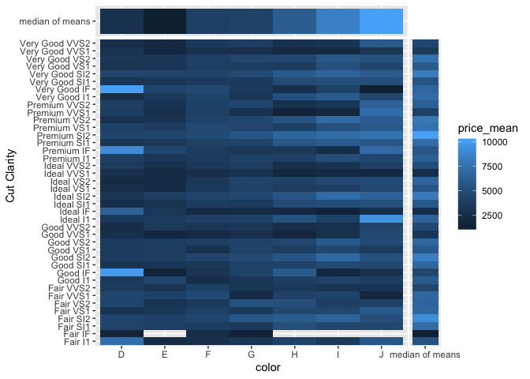
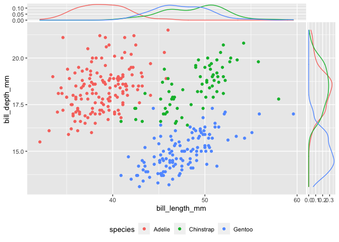

`ggside` sidebar tools
================
Zach
2019-12-10

**Purpose**: A reminder on how to use GGside to add sidebar plots

GGside is a useful package for adding summary data to the sides of a
plot. Here are some examples, adapted from the
[vignette](https://cran.r-project.org/web/packages/ggside/vignettes/ggside_basic_usage.html?utm_source=pocket_mylist).

Available geoms (xside and yside each): - Bar - Boxplot - Density -
Freqpoly - Histogram - Line - Path - Point - Text - Tile -
    Violin

# Setup

``` r
library(tidyverse)
```

    ## ── Attaching packages ──────────────────────────────── tidyverse 1.3.0 ──

    ## ✔ ggplot2 3.3.5     ✔ purrr   0.3.4
    ## ✔ tibble  3.1.2     ✔ dplyr   1.0.6
    ## ✔ tidyr   1.1.3     ✔ stringr 1.4.0
    ## ✔ readr   2.0.0     ✔ forcats 0.5.0

    ## ── Conflicts ─────────────────────────────────── tidyverse_conflicts() ──
    ## ✖ dplyr::filter() masks stats::filter()
    ## ✖ dplyr::lag()    masks stats::lag()

``` r
library(ggside)
```

    ## Registered S3 method overwritten by 'ggside':
    ##   method from   
    ##   +.gg   ggplot2

``` r
library(palmerpenguins)
```

Process a dataset to visualize.

``` r
df_diamonds_summary <- 
  diamonds %>%
  mutate(`Cut Clarity` = paste(cut, clarity)) %>%
  group_by(`Cut Clarity`,cut, clarity, color) %>%
  summarise(
    n = n(),
    price_mean = mean(price),
    price_sd = sd(price)
  )
```

    ## `summarise()` has grouped output by 'Cut Clarity', 'cut', 'clarity'. You can override using the `.groups` argument.

``` r
df_diamonds_summary
```

    ## # A tibble: 276 x 7
    ## # Groups:   Cut Clarity, cut, clarity [40]
    ##    `Cut Clarity` cut   clarity color     n price_mean price_sd
    ##    <chr>         <ord> <ord>   <ord> <int>      <dbl>    <dbl>
    ##  1 Fair I1       Fair  I1      D         4      7383     5899.
    ##  2 Fair I1       Fair  I1      E         9      2095.     824.
    ##  3 Fair I1       Fair  I1      F        35      2544.    2227.
    ##  4 Fair I1       Fair  I1      G        53      3187.    2598.
    ##  5 Fair I1       Fair  I1      H        52      4213.    3149.
    ##  6 Fair I1       Fair  I1      I        34      3501     2157.
    ##  7 Fair I1       Fair  I1      J        23      5795.    4594.
    ##  8 Fair IF       Fair  IF      D         3      1620.     525.
    ##  9 Fair IF       Fair  IF      F         4      2344      901.
    ## 10 Fair IF       Fair  IF      G         2      1488      511.
    ## # … with 266 more rows

# Recipies

## Tile plots

Visualize with tile sides:

``` r
df_diamonds_summary %>% 
  ggplot(aes(color, `Cut Clarity`)) +
  geom_tile(aes(color, fill = price_mean)) +
  geom_xsidetile(
    data = . %>% 
      group_by(color) %>% 
      summarize(val = median(price_mean)),
    mapping = aes(xfill = val, y = "median of means")
  ) +
  geom_ysidetile(
    data = . %>% 
      group_by(`Cut Clarity`) %>% 
      summarize(val = median(price_mean)),
    aes(x = "median of means", yfill = val)
  ) +
  theme()
```

<!-- -->

*Notes*:

  - `ggside` doesn’t manually carry out grouping for summaries
    under-the-hood; you’ll likely have to post-process the `data` within
    your plot.
  - `ggside` functions need manual overrides for the unused axis
      - for instance, if I didn’t set `x` in the `ysidetile` call above,
        I’d get a repeated `color` axis

## Density plots

``` r
penguins %>% 
  
  ggplot(aes(bill_length_mm, bill_depth_mm, color = species)) +
  geom_point() +
  geom_xsidedensity() +
  geom_ysidedensity() +
  theme(legend.position = "bottom")
```

    ## Warning: Removed 2 rows containing non-finite values (stat_density).
    
    ## Warning: Removed 2 rows containing non-finite values (stat_density).

    ## Warning: Removed 2 rows containing missing values (geom_point).

<!-- -->

*Notes*

  - The relevant vignette manually sets the density aesthetic, but
    `ggside` handles this automatically; you can leave out the `aes`
    call
