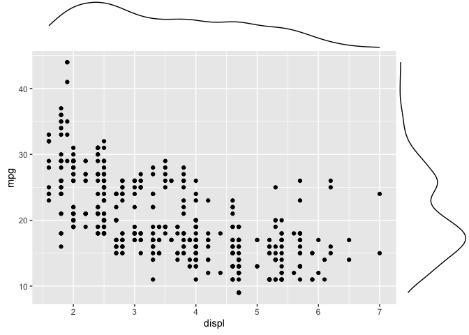
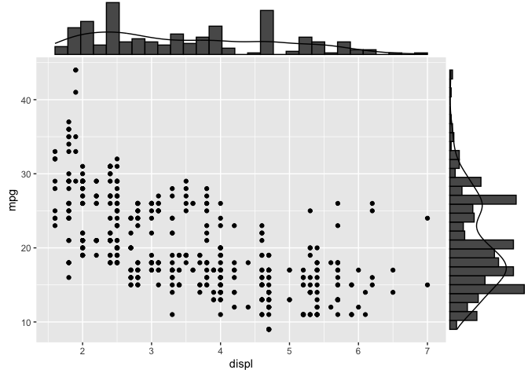
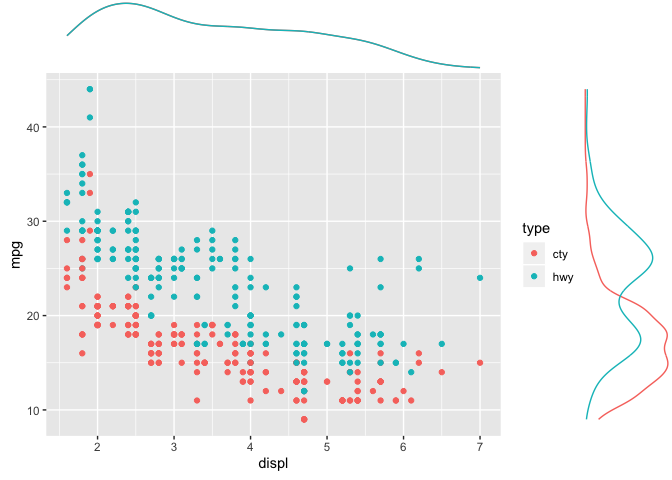

Marginals with ggExtra
================
Zach
2019-12-25

The package `ggExtra` has tools to add marginal distributions to a
`ggplot`. However, the syntax is non-standard, and does not fit in the
usual Tidyverse
    pipeline.

``` r
library(tidyverse)
```

    ## ── Attaching packages ────────────────────────────────── tidyverse 1.2.1 ──

    ## ✔ ggplot2 3.2.1     ✔ purrr   0.3.3
    ## ✔ tibble  2.1.3     ✔ dplyr   0.8.3
    ## ✔ tidyr   1.0.0     ✔ stringr 1.4.0
    ## ✔ readr   1.3.1     ✔ forcats 0.4.0

    ## ── Conflicts ───────────────────────────────────── tidyverse_conflicts() ──
    ## ✖ dplyr::filter() masks stats::filter()
    ## ✖ dplyr::lag()    masks stats::lag()

``` r
library(ggExtra)
```

To use `ggExtra::marginals()`, we have to pass the plot itself to the
function. I find that piping doesn’t work; I have to save to an
intermediate variable and pass explicitly:

``` r
p <-
  mpg %>%
  pivot_longer(names_to = "type", values_to = "mpg", cty:hwy) %>%

  ggplot(aes(displ, mpg)) +
  geom_point()

ggMarginal(p)
```

<!-- -->

You can change the type of marginal with the `type` keyword. Valid
choices are `density, histogram, boxplot, violin, densigram`.

``` r
p <-
  mpg %>%
  pivot_longer(names_to = "type", values_to = "mpg", cty:hwy) %>%

  ggplot(aes(displ, mpg)) +
  geom_point()

ggMarginal(p, type = "densigram")
```

<!-- -->

In order to show groups, you have to enable a flag based on the chosen
aesthetic. This is really obnoxious and easy to forget.

``` r
p <-
  mpg %>%
  pivot_longer(names_to = "type", values_to = "mpg", cty:hwy) %>%

  ggplot(aes(displ, mpg, color = type)) +
  geom_point()

ggMarginal(p, groupColour = TRUE)
```

<!-- -->
