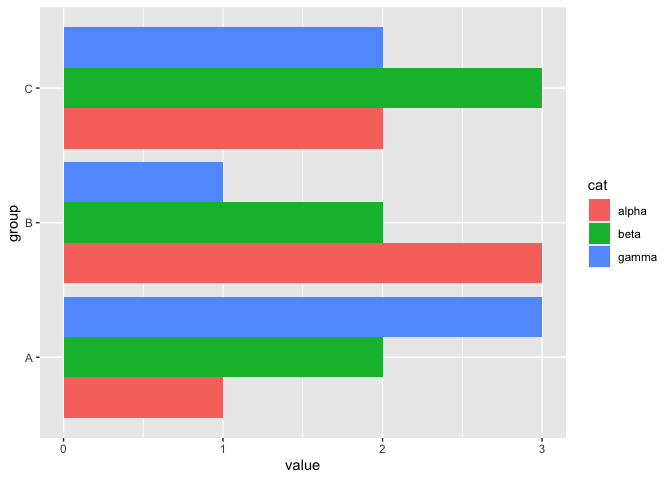
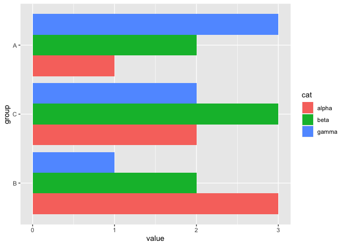

Reorder on a subcategory of factors
================
ZDR
2020-12-13

Set up some example
    data:

``` r
library(tidyverse)
```

    ## ── Attaching packages ─────────────────────────────────────── tidyverse 1.3.0 ──

    ## ✔ ggplot2 3.3.2     ✔ purrr   0.3.4
    ## ✔ tibble  3.0.3     ✔ dplyr   1.0.2
    ## ✔ tidyr   1.1.2     ✔ stringr 1.4.0
    ## ✔ readr   1.4.0     ✔ forcats 0.5.0

    ## ── Conflicts ────────────────────────────────────────── tidyverse_conflicts() ──
    ## ✖ dplyr::filter() masks stats::filter()
    ## ✖ dplyr::lag()    masks stats::lag()

``` r
df_test <-
  tribble(
    ~group, ~value, ~cat,
    "A", 1, "alpha",
    "A", 2, "beta",
    "A", 3, "gamma",
    "B", 3, "alpha",
    "B", 2, "beta",
    "B", 1, "gamma",
    "C", 2, "alpha",
    "C", 3, "beta",
    "C", 2, "gamma",
  )
```

Reorder factor according to `value`; this takes the median within each
group of `group`.

``` r
df_test %>%
  mutate(group = fct_reorder(group, value)) %>%

  ggplot(aes(group, value, fill = cat)) +
  geom_col(position = position_dodge()) +

  coord_flip()
```

<!-- -->

Suppose we want to reorder only on the cases where `cat == "gamma"`;
modify the data in-pipeline to ignore all non-gamma contributions.

``` r
df_test %>%
  mutate(
    group = fct_reorder(
      group,
      if_else(cat == "gamma", value, -1),
      .fun = max
    )
  ) %>%

  ggplot(aes(group, value, fill = cat)) +
  geom_col(position = position_dodge()) +

  coord_flip()
```

<!-- -->
