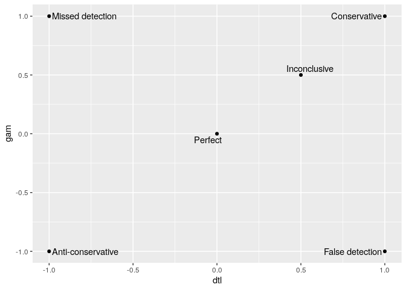

ggrepel
================
Zach
2019-12-31

**Purpose**: Reminder on key `ggrepel` features. Very brief; the
[vignette](https://cran.r-project.org/web/packages/ggrepel/vignettes/ggrepel.html)
is really good, and worth
    referencing.

``` r
library(tidyverse)
```

    ## ── Attaching packages ─────────────────────────────────────── tidyverse 1.3.0 ──

    ## ✔ ggplot2 3.2.1     ✔ purrr   0.3.3
    ## ✔ tibble  2.1.3     ✔ dplyr   0.8.3
    ## ✔ tidyr   1.0.0     ✔ stringr 1.4.0
    ## ✔ readr   1.3.1     ✔ forcats 0.4.0

    ## ── Conflicts ────────────────────────────────────────── tidyverse_conflicts() ──
    ## ✖ dplyr::filter() masks stats::filter()
    ## ✖ dplyr::lag()    masks stats::lag()

``` r
library(ggrepel)
```

`ggrepel` provides extremely useful tools for plotting text that
automatically dodges datapoints.

``` r
tribble(
  ~dtl, ~gam, ~gam_lo, ~gam_up, ~label,
     0,    0,       0,       0, "Perfect",
    -1,   -1,      -1,      -1, "Anti-conservative",
    +1,   +1,      +1,      +1, "Conservative",
    +1,   -1,      -1,      -1, "False detection",
    -1,   +1,      +1,      +1, "Missed detection",
  +0.5, +0.5,      -1,      +2, "Inconclusive"
) %>%

  ggplot(aes(dtl, gam)) +
  geom_point() +
  geom_text_repel(aes(label = label))
```

<!-- -->

However, the settings can be rather overwhelming. Key arguments are
summarized in the
[vignette](https://cran.r-project.org/web/packages/ggrepel/vignettes/ggrepel.html):

| Option        | Default    |
| ------------- | ---------- |
| force         | 1          |
| direction     | “both”     |
| max.iter      | 2000       |
| nudge\_x      | 0          |
| nudge\_y      | 0          |
| box.padding   | 0.25 lines |
| point.padding | 0 lines    |
| segment.color | “black”    |
| segment.size  | 0.5 mm     |
| segment.alpha | 1.0        |
| arrow         | NULL       |

One of the *most* key arguments is `point.padding`, which helps prevent
text from overlapping the points:

``` r
tribble(
  ~dtl, ~gam, ~gam_lo, ~gam_up, ~label,
     0,    0,       0,       0, "Perfect",
    -1,   -1,      -1,      -1, "Anti-conservative",
    +1,   +1,      +1,      +1, "Conservative",
    +1,   -1,      -1,      -1, "False detection",
    -1,   +1,      +1,      +1, "Missed detection",
  +0.5, +0.5,      -1,      +2, "Inconclusive"
) %>%

  ggplot(aes(dtl, gam)) +
  geom_point() +
  geom_text_repel(
    aes(label = label),
    point.padding = 1
  )
```

<!-- -->
