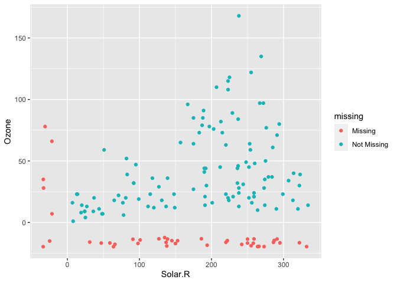

Visualizing NaNs with naniar
================
Zach
2022-09-26

**Purpose**: This is a brief reminder on the naniar package for
visualizing NaN values. The
[vignette](https://cran.r-project.org/web/packages/naniar/vignettes/getting-started-w-naniar.html)
is a much more complete reference.

``` r
library(tidyverse)
```

    ## Warning: replacing previous import 'lifecycle::last_warnings' by
    ## 'rlang::last_warnings' when loading 'pillar'

    ## Warning: replacing previous import 'lifecycle::last_warnings' by
    ## 'rlang::last_warnings' when loading 'tibble'

    ## ── Attaching packages ─────────────────────────────────────── tidyverse 1.3.0 ──

    ## ✓ ggplot2 3.3.5     ✓ purrr   0.3.4
    ## ✓ tibble  3.1.2     ✓ dplyr   1.0.6
    ## ✓ tidyr   1.1.3     ✓ stringr 1.4.0
    ## ✓ readr   2.0.0     ✓ forcats 0.5.0

    ## ── Conflicts ────────────────────────────────────────── tidyverse_conflicts() ──
    ## x dplyr::filter() masks stats::filter()
    ## x dplyr::lag()    masks stats::lag()

``` r
library(naniar)
```

`naniar::geom_miss_point` will visualize all rows in a dataset, even if
one or both of the columns contains `NaN` values. `NaN`s will be
visualized in the “margin” with a different color.

``` r
airquality %>% 
  ggplot(aes(Solar.R, Ozone)) +
  geom_miss_point()
```

<!-- -->
