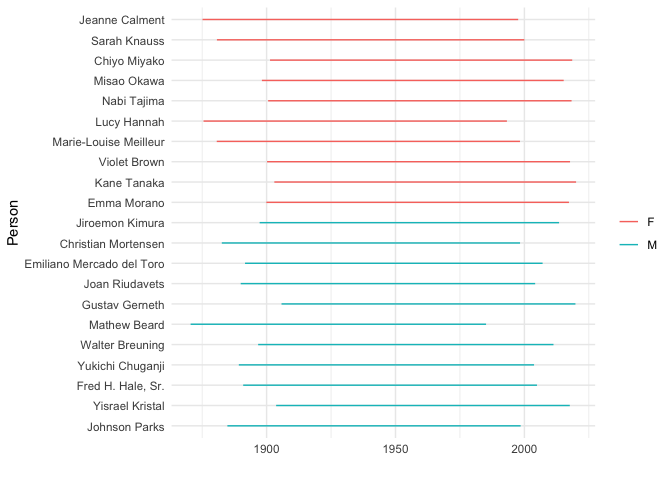

Scraping an HTML Table
================
Zach
2020-01-19

Simple recipe for scraping HTML
    tables.

``` r
library(tidyverse)
```

    ## ── Attaching packages ────────────────────────────────── tidyverse 1.2.1 ──

    ## ✔ ggplot2 3.2.1     ✔ purrr   0.3.3
    ## ✔ tibble  2.1.3     ✔ dplyr   0.8.3
    ## ✔ tidyr   1.0.0     ✔ stringr 1.4.0
    ## ✔ readr   1.3.1     ✔ forcats 0.4.0

    ## ── Conflicts ───────────────────────────────────── tidyverse_conflicts() ──
    ## ✖ dplyr::filter() masks stats::filter()
    ## ✖ dplyr::lag()    masks stats::lag()

``` r
library(rvest)
```

    ## Loading required package: xml2

    ## 
    ## Attaching package: 'rvest'

    ## The following object is masked from 'package:purrr':
    ## 
    ##     pluck

    ## The following object is masked from 'package:readr':
    ## 
    ##     guess_encoding

``` r
library(lubridate)
```

    ## 
    ## Attaching package: 'lubridate'

    ## The following object is masked from 'package:base':
    ## 
    ##     date

``` r
str_to_var <- function(str) {
  str %>%
    str_trim(.) %>%
    str_to_lower(.) %>%
    str_replace_all("\\s+", "_")
}
```

## Page Reading and Selecting

<!-- -------------------------------------------------- -->

First, we need the URL of the target page

``` r
url_page <- "https://en.wikipedia.org/wiki/Oldest_people"
```

Next, we need a *css selector* for our chosen table. To do so, we open
the target page in our browser, open the developer tools, find the html
element we want to select, and copy the CSS selector.

In Firefox Option + Command + C brings open the relevant console.

Doing the previous on the Oldest people page yields the following two
selectors.

``` r
css_women <- "table.wikitable:nth-child(15)"
css_men <- "table.wikitable:nth-child(18)"
```

## Wrangle

<!-- -------------------------------------------------- -->

We use rvest to read html pages and use the selectors to grab certain
tables.

``` r
## Read the page based on url
page <- read_html(url_page)

## Use html_nodes() and html_table()
df_women <-
  page %>%
  html_nodes(css_women) %>%
  html_table() %>%
  .[[1]] %>%
  as_tibble() %>%

  mutate(sex = "F") %>%
  rename_all(~str_remove_all(., "\\[.*\\]")) %>%
  rename_all(str_to_var)

df_men <-
  page %>%
  html_nodes(css_men) %>%
  html_table() %>%
  .[[1]] %>%
  as_tibble() %>%

  mutate(sex = "M") %>%
  rename_all(~str_remove_all(., "\\[.*\\]")) %>%
  rename_all(str_to_var)

## Bind two tables
df_data <-
  bind_rows(
    df_women,
    df_men
  ) %>%
  mutate(
    name = str_remove_all(name, "\\[.*\\]") %>%
        fct_reorder(., age),
    age = str_extract(age, "\\d+") %>% as.integer,
    birth_date = dmy(birth_date),
    death_date = dmy(death_date) %>%
      if_else(is.na(.), today(), .)
  )
```

    ## Warning: 1 failed to parse.

## Visualize

<!-- -------------------------------------------------- -->

``` r
df_data %>%

  ggplot() +
  geom_segment(
    aes(x = birth_date, xend = death_date, y = name, yend = name, color = sex)
  ) +

  scale_color_discrete(name = "") +
  theme_minimal() +
  labs(
    x = "",
    y = "Person"
  )
```

<!-- -->
