sf Filters
================
Zach
2020-01-29

The [sf](https://r-spatial.github.io/sf/index.html) package has a wide
variety of tools, but the documentation at the function level is poor
(the
[vignettes](https://r-spatial.github.io/sf/articles/sf3.html#geometrical-operations)
are nice, but cumbersome for reference).

The following are recipies for using sf tools to `filter()` GIS
    data.

    ## ── Attaching packages ────────────────────────────────────────────────────────────────── tidyverse 1.3.0 ──

    ## ✓ ggplot2 3.2.1     ✓ purrr   0.3.3
    ## ✓ tibble  2.1.3     ✓ dplyr   0.8.3
    ## ✓ tidyr   1.0.0     ✓ stringr 1.4.0
    ## ✓ readr   1.3.1     ✓ forcats 0.4.0

    ## ── Conflicts ───────────────────────────────────────────────────────────────────── tidyverse_conflicts() ──
    ## x dplyr::filter() masks stats::filter()
    ## x dplyr::lag()    masks stats::lag()

    ## Linking to GEOS 3.7.1, GDAL 2.4.0, PROJ 5.2.0

### Running Example Data

The following simple data are from an [sf
vignette](https://r-spatial.github.io/sf/articles/sf3.html#geometrical-operations):

``` r
## Red set
b0 = st_polygon(list(rbind(c(-1,-1), c(1,-1), c(1,1), c(-1,1), c(-1,-1))))
b1 = b0 + 2
b2 = b0 + c(-0.2, 2)
x = st_sfc(b0, b1, b2)
sf_x <- st_sf(x)

## Green set
a0 = b0 * 0.8
a1 = a0 * 0.5 + c(2, 0.7)
a2 = a0 + 1
a3 = b0 * 0.5 + c(1.5, -0.5)
y = st_sfc(a0,a1,a2,a3)
sf_y <- st_sf(y)

ggplot() +
  geom_sf(data = sf_x, color = "red", fill = NA) +
  geom_sf(data = sf_y, color = "green", fill = NA) +
  theme_void()
```

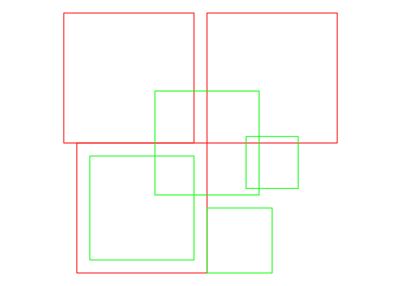<!-- -->

## Binary Logical Operations

<!-- -------------------------------------------------- -->

The sf binary logical operations are based on
[DE-9IM](https://en.wikipedia.org/wiki/DE-9IM); a framework for defining
binary relationships between topological objects. The following `sf`
calls implement these binary relationships.

|                         |                    |
| ----------------------- | ------------------ |
| st\_intersects(x, y)    | x intersects y     |
| st\_disjoint(x, y)      | x not Intersects y |
| st\_touches(x, y)       | x meets y          |
| st\_crosses(x, y)       | x crosses y        |
| st\_within(x, y)        | x inside y         |
| st\_contains(x, y)      | x contains y       |
| st\_overlaps(x, y)      | x overlaps y       |
| st\_equals(x, y)        | x equals y         |
| st\_covers(x, y)        | x covers y         |
| st\_covered\_by(x, y)   | x covered by y     |
| st\_equals\_exact(x, y) | x equals y exactly |

These functions—by default—return a sparse matrix of
    results:

``` r
y %>% st_intersects(., b0)
```

    ## Sparse geometry binary predicate list of length 4, where the predicate was `intersects'
    ##  1: 1
    ##  2: (empty)
    ##  3: 1
    ##  4: 1

To use these functions with `filter()`, we’ll need to disable the sparse
return:

``` r
y %>% st_intersects(., b0, sparse = FALSE)
```

    ##       [,1]
    ## [1,]  TRUE
    ## [2,] FALSE
    ## [3,]  TRUE
    ## [4,]  TRUE

We can easily integrate this in a tidyverse pipeline:

``` r
sf_y %>% 
  filter(st_intersects(., b0, sparse = FALSE))
```

    ## Simple feature collection with 3 features and 0 fields
    ## geometry type:  POLYGON
    ## dimension:      XY
    ## bbox:           xmin: -0.8 ymin: -1 xmax: 2 ymax: 1.8
    ## epsg (SRID):    NA
    ## proj4string:    NA
    ##                                y
    ## 1 POLYGON ((-0.8 -0.8, 0.8 -0...
    ## 2 POLYGON ((0.2 0.2, 1.8 0.2,...
    ## 3 POLYGON ((1 -1, 2 -1, 2 0, ...

### Illustration

Here we illustrate all of the binary relationships listed above.

``` r
sf_y %>% 
  mutate(intersects = st_intersects(., b0, sparse = FALSE)) %>% 
  
  ggplot() +
  geom_sf(aes(color = intersects), fill = NA) +
  geom_sf(data = b0, color = "black", fill = NA) +
  theme_void() +
  theme(legend.position = "bottom") +
  labs(title = "st_intersects")
```

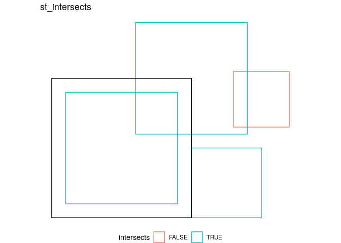<!-- -->

``` r
sf_y %>% 
  mutate(disjoint = st_disjoint(., b0, sparse = FALSE)) %>% 
  
  ggplot() +
  geom_sf(aes(color = disjoint), fill = NA) +
  geom_sf(data = b0, color = "black", fill = NA) +
  theme_void() +
  theme(legend.position = "bottom") +
  labs(title = "st_disjoint")
```

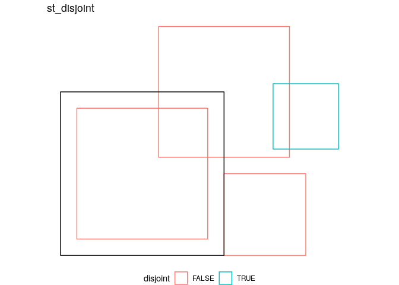<!-- -->

``` r
sf_y %>% 
  mutate(touches = st_touches(., b0, sparse = FALSE)) %>% 
  
  ggplot() +
  geom_sf(aes(color = touches), fill = NA) +
  geom_sf(data = b0, color = "black", fill = NA) +
  theme_void() +
  theme(legend.position = "bottom") +
  labs(title = "st_touches")
```

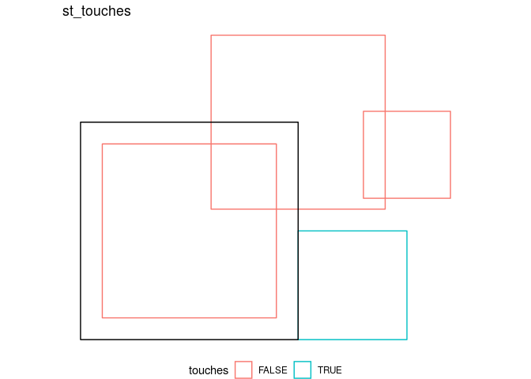<!-- -->

``` r
sf_y %>% 
  mutate(crosses = st_crosses(., b0, sparse = FALSE)) %>% 
  
  ggplot() +
  geom_sf(aes(color = crosses), fill = NA) +
  geom_sf(data = b0, color = "black", fill = NA) +
  theme_void() +
  theme(legend.position = "bottom") +
  labs(title = "st_crosses")
```

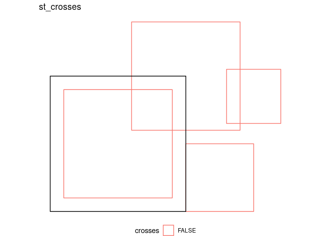<!-- -->

``` r
sf_y %>% 
  mutate(within = st_within(., b0, sparse = FALSE)) %>% 
  
  ggplot() +
  geom_sf(aes(color = within), fill = NA) +
  geom_sf(data = b0, color = "black", fill = NA) +
  theme_void() +
  theme(legend.position = "bottom") +
  labs(title = "st_within")
```

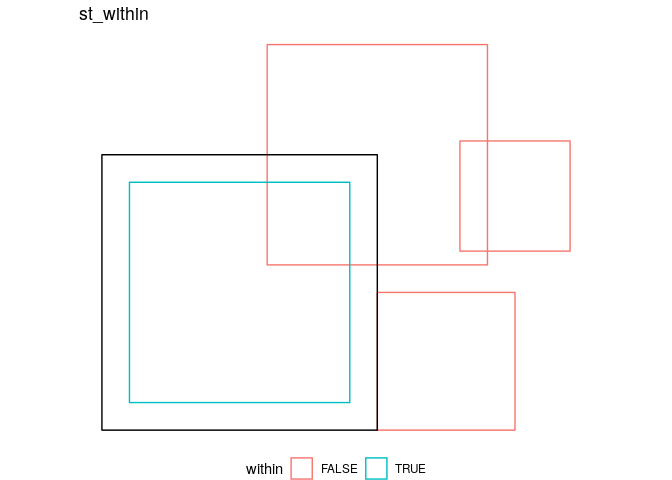<!-- -->

``` r
sf_y %>% 
  mutate(contains = st_contains(., b0, sparse = FALSE)) %>% 
  
  ggplot() +
  geom_sf(aes(color = contains), fill = NA) +
  geom_sf(data = b0, color = "black", fill = NA) +
  theme_void() +
  theme(legend.position = "bottom") +
  labs(title = "st_contains")
```

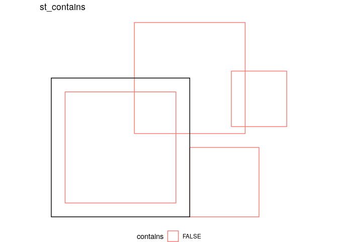<!-- -->

``` r
sf_y %>% 
  mutate(overlaps = st_overlaps(., b0, sparse = FALSE)) %>% 
  
  ggplot() +
  geom_sf(aes(color = overlaps), fill = NA) +
  geom_sf(data = b0, color = "black", fill = NA) +
  theme_void() +
  theme(legend.position = "bottom") +
  labs(title = "st_overlaps")
```

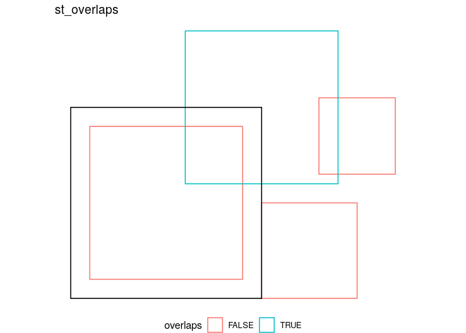<!-- -->

``` r
sf_y %>% 
  mutate(equals = st_equals(., b0, sparse = FALSE)) %>% 
  
  ggplot() +
  geom_sf(aes(color = equals), fill = NA) +
  geom_sf(data = b0, color = "black", fill = NA) +
  theme_void() +
  theme(legend.position = "bottom") +
  labs(title = "st_equals")
```

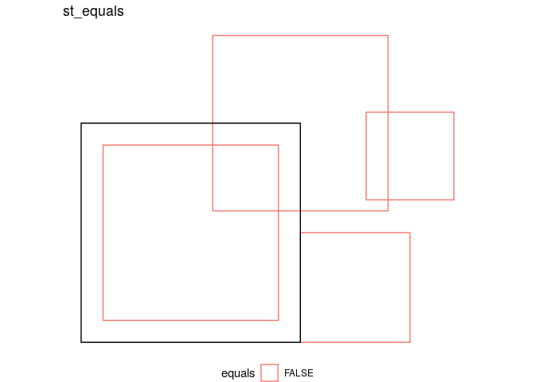<!-- -->

``` r
sf_y %>% 
  mutate(covers = st_covers(., b0, sparse = FALSE)) %>% 
  
  ggplot() +
  geom_sf(aes(color = covers), fill = NA) +
  geom_sf(data = b0, color = "black", fill = NA) +
  theme_void() +
  theme(legend.position = "bottom") +
  labs(title = "st_covers")
```

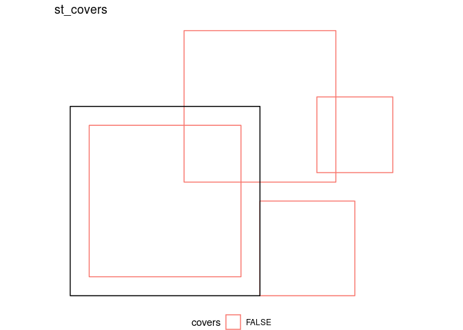<!-- -->

``` r
sf_y %>% 
  mutate(covered_by = st_covered_by(., b0, sparse = FALSE)) %>% 
  
  ggplot() +
  geom_sf(aes(color = covered_by), fill = NA) +
  geom_sf(data = b0, color = "black", fill = NA) +
  theme_void() +
  theme(legend.position = "bottom") +
  labs(title = "st_covered_by")
```

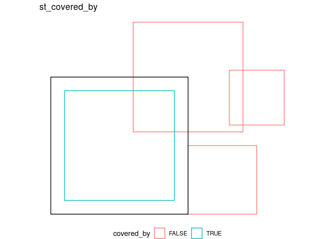<!-- -->

``` r
sf_y %>% 
  mutate(equals_exact = st_equals_exact(., b0, par = 0.01, sparse = FALSE)) %>% 
  
  ggplot() +
  geom_sf(aes(color = equals_exact), fill = NA) +
  geom_sf(data = b0, color = "black", fill = NA) +
  theme_void() +
  theme(legend.position = "bottom") +
  labs(title = "st_equals_exact")
```

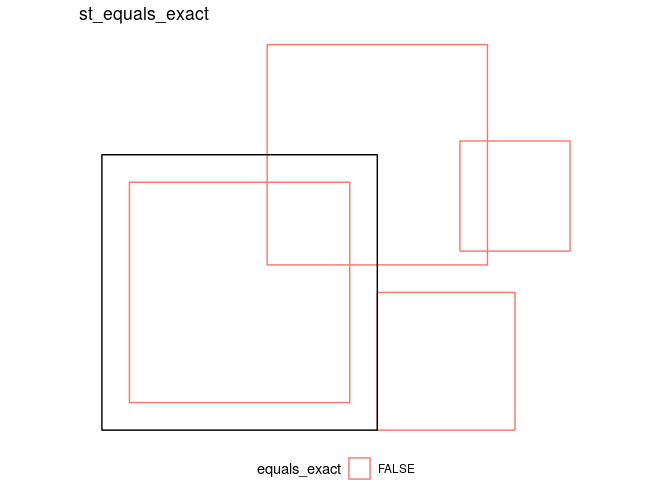<!-- -->
