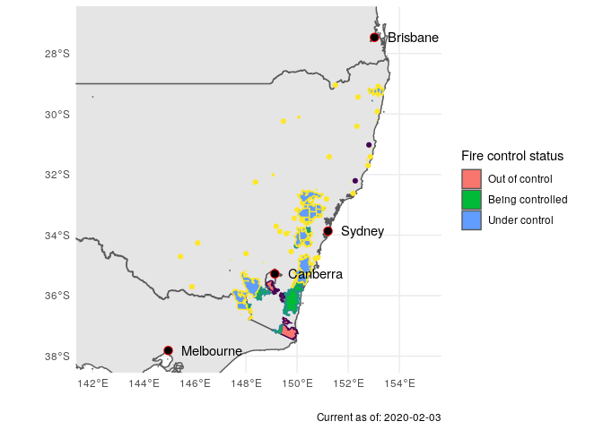

Geospatial Data
================
Zach
2020-01-20

Recipe for plotting geospatial data. Most of the difficulty is in
setting up your environment; using `sf` once installed is relatively
straightforward.

## Environment Setup

<!-- -------------------------------------------------- -->

I find that manually installing the correct dependencies for the `sf`
package is nightmarish. Instead, I use the
[rocker/geospatial](https://hub.docker.com/r/rocker/geospatial) Docker
image to automatically handle this installation. Most of the difficulty
in environment setup is then due to setting up docker.

Idea: Run a docker container with all dependencies. Writing geospatial
analyses can then be done through a web browser accessing the docker
container.

Here are the steps:

1.  Install [docker](https://docs.docker.com/install/)
2.  Copy dependencies to target folder:
    1.  `Makefile` - automates setup and running
    2.  `run-rstudio` - automates starting docker
    3.  `user-settings` - settings file for Rstudio
3.  Run `$ make setup`. This will pull `rocker/geospatial` and make a
    directory for data
4.  Add `export RSTUDIO_PASS=USER_SELECTED_PASSWORD` to your terminal
    config. Use this to login to the Rstudio instance in the container.

The steps above *set up* the container. To activate, run `$ make start`;
this should open a web browser. The login info will be

> Username: rstudio Password: USER\_SELECTED\_PASSWORD

You may need to manually open your browser, in which case navigate to
`http://localhost:8787/`. When you’re done working, you can run `$ make
stop` to halt the Docker
    container.

## Code Setup

<!-- -------------------------------------------------- -->

``` r
library(tidyverse)
```

    ## ── Attaching packages ──────────────────────────────────────────────────────────────────── tidyverse 1.3.0 ──

    ## ✓ ggplot2 3.2.1     ✓ purrr   0.3.3
    ## ✓ tibble  2.1.3     ✓ dplyr   0.8.3
    ## ✓ tidyr   1.0.0     ✓ stringr 1.4.0
    ## ✓ readr   1.3.1     ✓ forcats 0.4.0

    ## ── Conflicts ─────────────────────────────────────────────────────────────────────── tidyverse_conflicts() ──
    ## x dplyr::filter() masks stats::filter()
    ## x dplyr::lag()    masks stats::lag()

``` r
library(sf)
```

    ## Linking to GEOS 3.7.1, GDAL 2.4.0, PROJ 5.2.0

``` r
library(lubridate)
```

    ## 
    ## Attaching package: 'lubridate'

    ## The following object is masked from 'package:base':
    ## 
    ##     date

## Downloading data

<!-- -------------------------------------------------- -->

With the data directory mounted, you can download data programmatically
and extract to the directory. This is useful if you want to document
where the data came from, for reproducibility.

As an example, I found Australia fire reports and boundary data.

``` r
# Latests Australia fire data
url <- "http://www.rfs.nsw.gov.au/feeds/majorIncidents.json"
df_aus_fires <- sf::st_read(url)
```

    ## Reading layer `majorIncidents' from data source `http://www.rfs.nsw.gov.au/feeds/majorIncidents.json' using driver `GeoJSON'
    ## Simple feature collection with 89 features and 7 fields
    ## geometry type:  GEOMETRY
    ## dimension:      XY
    ## bbox:           xmin: 144.5517 ymin: -37.4437 xmax: 153.5226 ymax: -28.37562
    ## epsg (SRID):    4326
    ## proj4string:    +proj=longlat +datum=WGS84 +no_defs

``` r
# Australia boundary data
url_aus_geo <- "http://data.daff.gov.au/data/warehouse/nsaasr9nnd_022/nsaasr9nnd_02211a04es_geo___.zip"
curl::curl_download(url_aus_geo, destfile = "../data/aus.shp.zip")
unzip("../data/aus.shp.zip", exdir = "../data")
```

Load boundary data.

``` r
df_boundaries <- sf::read_sf("../data", "aust_cd66states")
```

## Wrangle

<!-- -------------------------------------------------- -->

Simple feature `sf` data can be used in a Tidyverse pipeline. We can use
this to process the descriptions for `control` information.

The fire data come with prose descriptions of fires:

``` r
df_aus_fires %>% 
  head(2) %>% 
  pull(description)
```

    ## [1] ALERT LEVEL: Advice <br />LOCATION: bugtown road <br />COUNCIL AREA: Snowy Monaro <br />STATUS: Being controlled <br />TYPE: Bush Fire <br />FIRE: Yes <br />SIZE: 93650 ha <br />MAJOR FIRE UPDATE AS AT 20 Jan 2020 8:10AM: <a href='http://www.rfs.nsw.gov.au/fire-information/major-fire-updates/mfu?id=8891' target='_blank'> More information</a><br />RESPONSIBLE AGENCY: Rural Fire Service <br />UPDATED: 20 Jan 2020 15:59                         
    ## [2] ALERT LEVEL: Advice <br />LOCATION: Badja Forest Rd, Countegany, NSW 2630 <br />COUNCIL AREA: Eurobodalla <br />STATUS: Being controlled <br />TYPE: Bush Fire <br />FIRE: Yes <br />SIZE: 242442 ha <br />MAJOR FIRE UPDATE AS AT 20 Jan 2020 7:30PM: <a href='http://www.rfs.nsw.gov.au/fire-information/major-fire-updates/mfu?id=8525' target='_blank'> More information</a><br />RESPONSIBLE AGENCY: Rural Fire Service <br />UPDATED: 20 Jan 2020 15:17
    ## 89 Levels: ALERT LEVEL: Advice <br />LOCATION: -31.332  151.292 <br />COUNCIL AREA: Tamworth <br />STATUS: Under control <br />TYPE: Bush Fire <br />FIRE: Yes <br />SIZE: 703 ha <br />RESPONSIBLE AGENCY: Rural Fire Service <br />UPDATED: 20 Jan 2020 11:16 ...

This is human-readable, but not machine-readable. We can extract the
`STATUS` information with a regular expression:

``` r
df_aus_control <-
  df_aus_fires %>%
  mutate(
    control = str_extract(description, "STATUS: [\\w|\\s]+") %>%
      str_remove(., "STATUS: ") %>%
      str_trim(.) %>%
      ordered(., c("Out of control", "Being controlled", "Under control")),
    pubDate = dmy_hms(pubDate)
  )

df_aus_control %>% glimpse
```

    ## Observations: 89
    ## Variables: 9
    ## $ title            <fct> "Adaminaby Complex ", "Badja Forest Rd, Countegany",…
    ## $ link             <fct> http://www.rfs.nsw.gov.au/fire-information/major-fir…
    ## $ category         <fct> Advice, Advice, Advice, Advice, Advice, Advice, Advi…
    ## $ guid             <fct> https://incidents.rfs.nsw.gov.au/api/v1/incidents/36…
    ## $ guid_isPermaLink <fct> true, true, true, true, true, true, true, true, true…
    ## $ pubDate          <dttm> 2020-01-20 04:59:00, 2020-01-20 04:17:00, 2020-01-2…
    ## $ description      <fct> "ALERT LEVEL: Advice <br />LOCATION: bugtown road <b…
    ## $ geometry         <GEOMETRY [°]> GEOMETRYCOLLECTION (POINT (..., GEOMETRYCOL…
    ## $ control          <ord> Being controlled, Being controlled, Being controlled…

Check the levels of the `control` data:

``` r
df_aus_control %>% pull(control) %>% unique
```

    ## [1] Being controlled Under control    Out of control  
    ## Levels: Out of control < Being controlled < Under control

## Visualize

<!-- ----------------------------------------------------------------- -->

### GIS

<!-- --------------------------- -->

Geographic distribution of fires and their degree of control.

``` r
fires_crs <- st_crs(df_aus_control)

# Lat-lon data for Australian cities
df_cities_latlon <- tribble(
       ~lat,     ~lon, ~city,
  +115.8605, -31.9505, "Perth",
  +138.6007, -34.9285, "Adelaide",
  +153.0251, -27.4698, "Brisbane",
  +151.2093, -33.8688, "Sydney",
  +149.1300, -35.2809, "Canberra",
  +144.9631, -37.8136, "Melbourne"
)
sf_cities_latlon <-
  st_as_sf(
    df_cities_latlon,
    coords = c("lat", "lon"),
    crs = 4326,
    agr = "constant"
  )

ggplot() +
  geom_sf(data = df_boundaries %>% st_set_crs(fires_crs)) +
  geom_sf(
    data = df_aus_control,
    mapping = aes(fill = control, color = control)
  ) +
  geom_sf(
    data = sf_cities_latlon,
    shape = 21,
    size = 3,
    color = "red",
    fill = "black"
  ) +
  geom_text(
    data = df_cities_latlon,
    aes(lat, lon, label = city),
    hjust = 0,
    nudge_x = +0.5
  ) +
  ## Tail
  scale_fill_discrete(name = "Fire control status") +
  coord_sf(
    xlim = c(+142, +155),
    ylim = c(-38, -27)
  ) +
  guides(color = FALSE) +
  theme(legend.position = "right") +
  theme_minimal() +
  labs(x = "", y = "", caption = str_c("Current as of: ", today()))
```

<!-- -->

The fires are concentrated around Canberra and Sydney. Of course, smoke
is probably affecting nearby cities as well.
